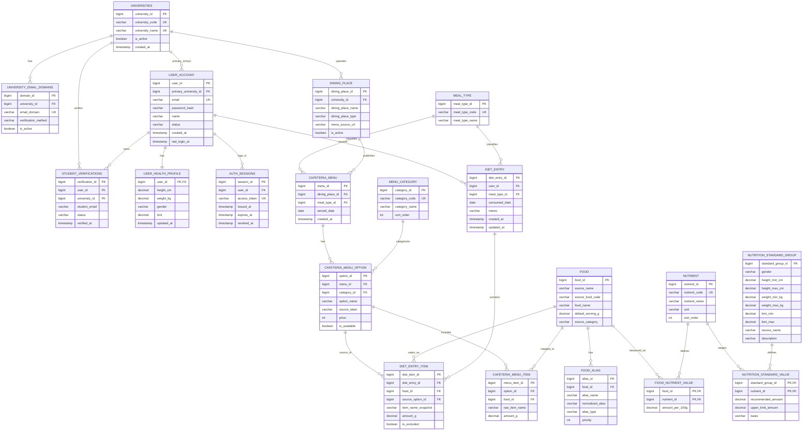

# 끼록 MVP ERD

이번 1차 구현은 기능보다 데이터베이스 설계를 우선해, MySQL용 `schema.sql` 기반으로 구성한다. 기존 초안 대비 주요 수정점은 다음과 같다.

- 학교 인증은 `user_account.university_id` 하나로 끝내지 않고 `universities`, `university_email_domains`, `student_verifications`로 분리했다. 현재는 한 학교만 쓰지만, 다른 대학교 도메인/인증 정책을 추가할 수 있다.
- 가입 시 입력한 키, 몸무게, 성별은 `user_health_profile`에 저장하고 BMI는 서버에서 계산해 `bmi` 컬럼에 저장한다.
- 학생식당 점심의 한식/양식 같은 분류는 `cafeteria_menu_option.category_id`로 표현한다. 기숙사식당 중식/석식은 `DEFAULT` 단일 옵션으로 저장한다.
- 식단 제외는 삭제가 아니라 `diet_entry_item.is_excluded`로 처리해 원본 기록을 보존한다.
- 음식 별칭 검색 확장은 `food_alias` 테이블을 둬서 데이터만 추가해도 검색에 반영되도록 했다.

## 핵심 제약

- `user_account.email`은 전역 유니크다.
- `student_verifications`는 `(university_id, student_email)` 유니크로 학교별 인증 이메일 중복을 막는다.
- `user_health_profile.user_id`는 PK이자 FK라 사용자당 프로필은 1개만 존재한다.
- `cafeteria_menu`는 `(dining_place_id, meal_type_id, served_date)` 유니크다.
- `cafeteria_menu_option`은 `(menu_id, option_name)` 유니크다.
- `diet_entry`는 `(user_id, meal_type_id, consumed_date)` 유니크라 하루 한 끼 기록을 하나로 모은다.
- `food_alias`는 `(food_id, normalized_alias)` 유니크다.
- `food_nutrient_value`와 `nutrition_standard_value`는 복합 PK로 영양소별 값을 관리한다.
