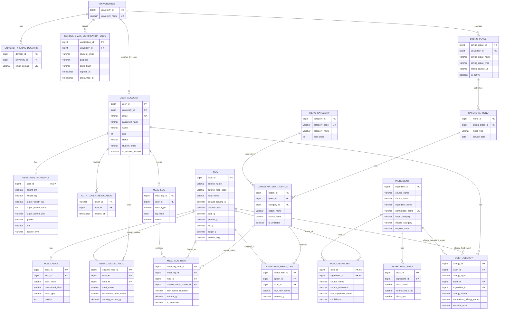

# 끼록 MVP ERD

이번 1차 구현은 기능보다 데이터베이스 설계를 우선해, MySQL용 Flyway migration 기반으로 구성한다. 실제 구현 SQL과 Java migration은 `src/main/resources/db/migration`, `src/main/java/db/migration`에 버전별로 저장한다.

## 반영한 설계 기준

- 학교는 사용자가 직접 선택하지 않고 이메일 도메인으로 자동 판별한다. 도메인이 등록된 학교 이메일이면 `user_account.university_id`, `student_email`, `is_student_verified`에 저장한다.
- 이메일 인증코드는 회원가입이 완료되기 전 검증이 필요하므로 `school_email_verification_code`에 해시, 만료시간, 사용시간을 저장한다.
- 로그인 세션 테이블은 제거했고, JWT 로그아웃 처리를 위해 무효화된 토큰만 `auth_token_revocation`에 저장한다.
- `diet_entry`, `diet_entry_item`은 서비스 용어에 맞춰 `meal_log`, `meal_log_item`으로 변경했다.
- `meal_type` 테이블은 제거하고 `meal_log.meal_type`, `cafeteria_menu.meal_type` 코드값으로 직접 저장한다.
- 식단 제외는 삭제가 아니라 `meal_log_item.is_excluded`로 처리해 원본 기록을 보존한다.
- 학생식당 점심의 한상한담/ONE PLATE/Noodle/셀프라면 같은 분류와 생활관식당 점심/저녁 메뉴 구분은 `cafeteria_menu_option.category_id`로 표현한다.
- 음식 별칭 검색 확장은 `food_alias` 테이블을 둬서 데이터만 추가해도 검색에 반영되도록 했다.
- 법정 알레르기 전용 테이블은 제거했고, 우유/계란/땅콩 같은 알레르기 가능 재료도 일반 `ingredient` 및 `ingredient_alias` 데이터로 관리한다.
- 사용자 알레르기는 음식과 원재료를 나누어 별도 테이블에 저장하지 않고 `user_allergy` 하나에 `FOOD`, `INGREDIENT` 타입으로 저장한다.
- 개인별 권장섭취량은 프로필 기반 공식으로 조회 시 계산하므로 `nutrition_standard_group`, `nutrition_standard_value` 테이블은 제거했다.

## 식당 메뉴 비교용 조회 View

식당 메뉴 비교 화면은 기본 테이블을 직접 모두 조인하지 않고 `v_menu_option_comparison` view를 읽는다. 저장 구조는 계속 정규화된 테이블을 기준으로 유지한다.

- `cafeteria_menu`, `dining_place`, `cafeteria_menu_option`, `menu_category`는 학교/식당/날짜/끼니/옵션 정보를 분리해 저장한다.
- `cafeteria_menu_item`은 옵션에 포함된 원문 메뉴 항목을 저장하고, 가능한 경우 `food`와 연결한다.
- `food`는 표준 음식의 100g 기준 영양값만 저장한다.
- `v_menu_option_comparison`은 비교 API가 쓰기 쉬운 읽기 전용 결과를 제공한다. 옵션 자체에 영양값이 있으면 그 값을 우선 사용하고, 없으면 메뉴 항목과 `food`를 조인해 옵션 단위 영양 합계를 계산한다.

## 핵심 제약

- `user_account.email`은 전역 유니크다.
- `user_account.age`는 1 이상 120 이하 값으로 저장한다.
- 학교 이메일 인증 결과는 `user_account.university_id`, `student_email`, `is_student_verified`에 저장한다.
- `school_email_verification_code`는 인증코드 원문이 아니라 해시만 저장한다.
- `user_health_profile.user_id`는 PK이자 FK라 사용자당 프로필은 1개만 존재한다.
- `cafeteria_menu`는 `(dining_place_id, meal_type, served_date)` 유니크다.
- `cafeteria_menu_option`은 `(menu_id, option_name)` 유니크다.
- `meal_log`는 `(user_id, meal_type, log_date)` 유니크라 하루 한 끼 기록을 하나로 모은다.
- `food_alias`는 `(food_id, normalized_alias)` 유니크다.
- `user_custom_food`는 `(user_id, normalized_food_name)` 유니크라 같은 사용자가 같은 직접 등록 음식을 중복 저장하지 않는다.
- `food`는 100g 기준 영양값(`calories_kcal`, `carb_g`, `protein_g`, `fat_g`, `sugar_g`, `sodium_mg`)을 직접 가진다.
- `user_allergy`는 `(user_id, allergy_type, normalized_allergy_name)` 유니크라 같은 타입의 알레르기를 중복 등록하지 않는다.
